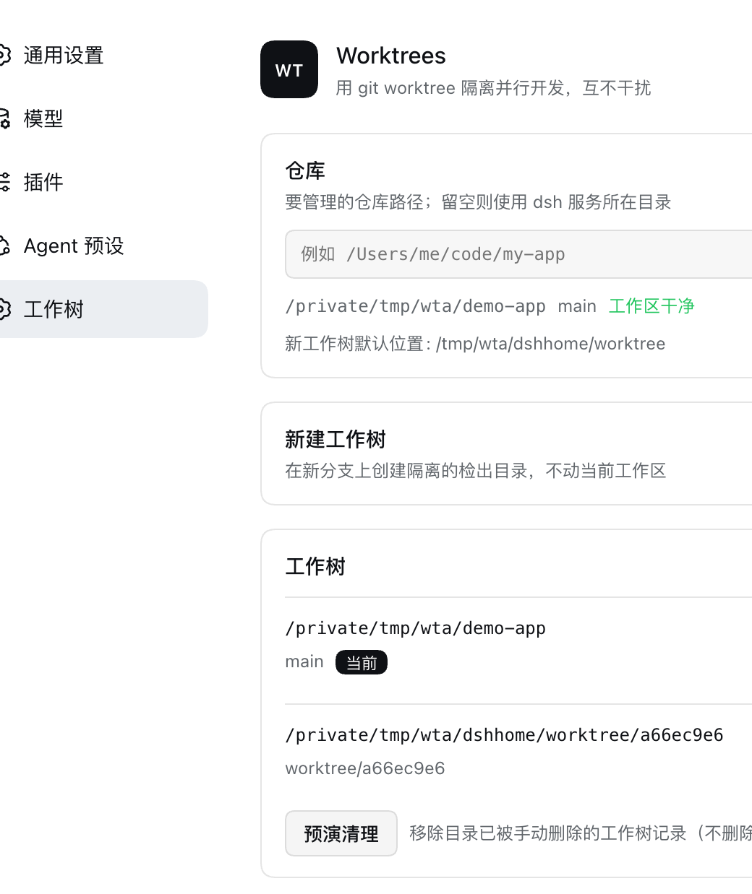
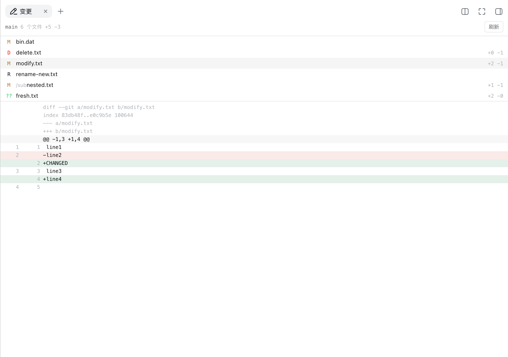

# gord-dsh-worktree

Git worktree management for [DeepSeek Harness](https://github.com/deepseek-ai/deepseek-harness) — isolate
parallel work in its own directory and branch, from the agent or from Settings.

[中文说明](README.zh.md)


## What it does

- **Agent tools** — `worktree_list`, `worktree_create`, `worktree_status`, `worktree_remove`, `worktree_prune`.
  An agent can branch off an isolated checkout for a task instead of doing everything in one working tree.
- **Worktree selector** — a dropdown on the New Session row, beside the workspace and preset
  controls: it defaults to the current workspace, and offers the project's other worktrees or
  creating a new one. It is present only while the session is still blank.
- **Settings page** — *Settings → Worktrees*: the repository's worktrees with branch/HEAD and
  current/detached/locked/pruned badges, a create form (branch, base, directory), dry-run prune, and
  one-click **Open as workspace** so a new worktree becomes a sidebar workspace you can start a session in.

  
- **Changes tab** — the right sidebar's *Changes* tab: the uncommitted diff of the session's own
  directory, file by file, with per-file counts and the patch. It follows a session into a worktree
  without being told it did, because it asks about that session's directory rather than a fixed one.
- **Remote branches are picked up, not shadowed** — naming a branch that exists only on a remote
  checks that remote branch out from its real commit and sets it as upstream. If you name a base
  anyway, the shadowed remote is reported rather than silently ignored.
- **No manual git** — creation is one atomic `git worktree add -b`, and the new directory defaults to
  `$DSH_HOME/worktree/`, outside every repository: nothing to add to `.gitignore` and forget, nothing
  for a build or a search to walk. The repository is unaffected either way — a worktree is linked from
  `.git/worktrees`, so its location never mattered to git.

## Picking up someone else's branch

`worktree_create` with `branch: colleague/feature` and **no** `base` starts from
`origin/colleague/feature` and tracks it. This is the case that used to be quietly wrong: the branch
did not exist locally, so git created a fresh empty branch of the same name off the current one and
the caller believed they held the colleague's commits.

An explicit `base` is still honoured — a deliberate *new branch from main* has to stay possible — but
the result then carries `shadowedRemote` so the ambiguity is visible.

## Working location for a New Session

The menu offers exactly two entries: **Current worktree**, where a session starts unless you ask
otherwise, and **New worktree**. Existing worktrees are deliberately not listed — they are second
checkouts of a project the session already belongs to, so a worktree is reached by its path rather than
by a second sidebar entry.

**New worktree takes no input and asks no questions.** The branch is cut from the current one and named
for the code that names the directory, so the whole decision is "a fresh checkout" versus "here". Pick
it and you are in the new worktree: the worktree is made, registered, and a session is started and
opened inside it, ready for your first message. Once there, the branch is yours — create or switch
branches with ordinary git when the task calls for it; changing branch does not need a new worktree.

**It has to happen on the click, not on the first message.** A session's directory is fixed when the
session is created, and the blank session in the composer is created before anything is typed, so there
is no later moment at which a message could be aimed at a directory that does not exist yet. Creating
the worktree and the session together is the only order that works; a version that created the worktree
and left the session alone reported success and quietly ran the conversation in the project anyway.

**A worktree is registered as a workspace, and that is not a choice.** Workspace membership is exact
path equality (`sessionPath(id) === record.path`), `attachSession` rejects a session whose cwd differs
from its workspace path, and the record itself carries no hidden or archived flag. A session rooted in a
worktree therefore needs a workspace at that path — without one the shell has nowhere to draw it and
shows *choose a workspace to start* over a session that does exist. So each worktree you start a session
in appears in the sidebar beside the project, titled by its directory code, exactly as the core's own
*new workspace* flow would leave it. Registering on its own is also available as the explicit
**Open as workspace** action in Settings.

Only this route adopts. `worktree_create` does not: a worktree made mid-conversation leaves the session
where it is, so it needs no workspace, and adopting there would add a sidebar entry nobody asked for.

### Showing a worktree under its project

The worktree's sessions can be shown under the project's own group, one level in from where they land
by default. This needs a patch to DSH, and the patch is in this repository:

```sh
npm run patch:sidebar     # then restart dsh web
npm run unpatch:sidebar   # to restore the shipped bundle
```

It changes one small function — `groupByWorkspace`, the whole of the sidebar's grouping — so a worktree's
sessions fold into the project's group and the worktree stops being a group of its own. That is how Codex
reads, and for the same reason: it groups threads by project and treats the worktree as a thread
attribute, while DSH's grouping key is the directory and its records have no parent field. Two rules
decide the parent: a workspace whose directory is inside another's, and a parent map this plugin
publishes for worktrees kept outside the project — which is the default, `$DSH_HOME/worktree/<code>`.
The map is read from `localStorage` because the first render after a reload already needs the answer and
a fetch would land too late.

Why a patch and not the plugin: a client plugin can only nest by taking over the whole
`sidebar.workspaces` slot, which is `single` and owns the section header, the search box, every session
row and every workspace dialog — 14 components, with drag reordering, rename, archive and fork. Taking it
over would mean reimplementing all of it and drifting from core on every release. The grouping function
is a dozen lines.

**A DSH upgrade replaces the file, so re-run `npm run patch:sidebar` after one.** The script is
idempotent, keeps the shipped bundle at `client.js.orig` before the first patch, and refuses to guess if
the function is not in the shape it expects — a newer DSH needs the patch updated rather than forced.
`npm run patch:sidebar -- --check` reports whether a bundle is patched and exits non-zero when it is not.

### Keeping the sidebar clean

The worktree's workspace is titled after its project — `repo · 1dda6ec0`, not a bare `1dda6ec0` — because
the title is the only place that relationship can be shown. The sidebar groups by workspace, one group per
directory, with no nesting and no hidden flag on the record, so a worktree is a group of its own whether or
not it looks like one. Codex reads cleanly here for a structural reason rather than a smarter trick: it
groups threads by *project* and treats the worktree as an attribute of a thread, so a worktree thread simply
lands under its project. DSH's grouping key is the directory, so there is nothing to nest into.

If you would rather not see the groups at all, the shell already has the mode for it: **View options →
Group by → In one list** in the sidebar header. Sessions from every workspace become one recency-ordered
list, so a worktree session sits beside the project's with no heading of its own. It is a saved preference,
it applies immediately, and no plugin change is involved — it is the closest thing to Codex's sidebar that
the current shell offers.

The menu dismisses on a pointer anywhere outside the control and on Escape (which also returns focus to
the trigger). The core selectors get that from the shared `Menu` primitive; this one cannot use it,
because this panel is not a flat `{id, label}` list — it carries a status line and a busy state — so the
behaviour is reproduced directly.

It sits on the Hero's own working-location row, beside the workspace and preset controls, and is styled
to match them exactly: the same borderless 16px-radius pill, the same 13px/500 type, the same shared
chevron and icon package. The icons come from `@deepseek-ai/dsh-client-ui-primitives`, which is
declared in `dsh.client.inject` — a client plugin can only `require` a package the boot graph wires in.
That row is
laid out by the core plugin and all three `conversation.hero.*` slots are `single`, where a second
occupant *shadows* the first instead of sitting beside it — so the control is rendered onto the row's
element with `createPortal`, which is how the core plugins place themselves inside surfaces they do
not own. The row is found from this plugin's own host outward via the `conversation.hero.workspace`
`data-slot` anchor, not by a document-wide query. If no row can be found the control renders in place
rather than disappearing.

## Reviewing changes in the sidebar

The right sidebar's *Changes* tab shows the uncommitted diff of the session's own directory: every
file that differs from `HEAD`, its status and line counts, and the selected file's patch with both
line-number columns. It is the working tree against `HEAD` — staged and unstaged together — rather
than the session's own edits, because what a person reviews before committing is what is on disk,
whichever tool put it there: an agent's file edit, a formatter, or their own editor in the next
window. The session's own edits are already diffed inline in the conversation, from the tools' own
reports.

A worktree is an ordinary repository to it. The tab asks the host about the directory the session
runs in, so a session that moves into a worktree follows along without the tab being told it did.



It is registered through the same `sidebarRightTabs` registry the built-in file tree and document
preview use, and both of its slots — the body and the tab title — are injected from a child scope, so
a profile composed without the right sidebar loses the tab instead of failing to apply the plugin.
Open it from the right sidebar's start page, where it is listed beside *Workspace files*.

## Renamed from `dsh-worktree`

The package id, module id, HTTP routes, and settings namespace are all
`gord-dsh-worktree` now. If you installed under the old name:

```sh
dsh plugin --profile web remove dsh-worktree
dsh plugin --profile web add github:nightosong/gord-dsh-worktree
```

## Install

```sh
dsh plugin --profile web add github:nightosong/gord-dsh-worktree
```

Then restart `dsh web` (a reload is enough once the bundle is on the layer stack) and open
**Settings → Worktrees**. Nothing else needs editing: the package declares `dsh.bundle.patch`, so the
CLI adds it to the profile's bundle stack itself.

Requires dsh `0.1.5-rc.1` or newer.

## Tools

| Tool | What it does |
| ---- | ------------ |
| `worktree_list` | Every worktree of a repository: path, branch, HEAD, and current/detached/locked/pruned state — plus every local and remote-tracking branch, which is what to consult before naming a base. |
| `worktree_create` | Creates the directory and its branch in one command; checks out an existing branch instead of recreating it, and starts from a remote-tracking branch of the same name when only that exists. |
| `worktree_status` | One worktree's branch, upstream line, and changed files. |
| `worktree_remove` | Removes a worktree. Refuses when it holds uncommitted or untracked changes; `force` discards them on purpose. |
| `worktree_prune` | Drops records of worktrees whose directories are gone. Deletes no files. |

All five resolve the repository from the session directory by default and accept `workdir` (or `repo`) to
point at another one.

## Safety rules

- The main worktree is never removable.
- A dirty worktree is never removed without `force` — and "dirty" counts untracked files, because
  `worktree remove --force` would delete them.
- A locked worktree is reported, not silently unlocked.
- Branch names are validated by `git check-ref-format`, and every worktree path is passed to git as a
  positional argument, never through a shell, so a name can never become a flag.
- The HTTP surface the panel uses runs git on this machine, so the mutating route accepts same-origin
  and loopback callers only. It is not a remote API.

## Settings

| Field | Default | Meaning |
| ----- | ------- | ------- |
| `defaultParent` | *(empty)* | Directory new worktrees are created in. Empty uses `$DSH_HOME/worktree/`. |

## Development

The plugin is plain ESM with no build step: `lib/index.js` is the host half, `lib/client.js` is the
browser bundle loaded through `window.__ModuleLoader__`, and `lib/service.js` + `lib/worktree.js` hold the
git logic both halves share.

```sh
# install a checkout into a profile as a live dependency
dsh plugin --profile web add /absolute/path/to/gord-dsh-worktree
```

A checkout installed by path resolves Node imports from its own directory, while DSH's packages resolve
from the profile — so the host half cannot see `@deepseek-ai/dsh-tools` unless the checkout can reach
them. Link the peers once in a local checkout (they are gitignored):

```sh
mkdir -p node_modules/@deepseek-ai
SRC=$(dirname "$(readlink -f "$(which dsh)")")/../node_modules/@deepseek-ai
for p in schemastery dsh-tools dsh-settings cordis; do
  ln -sfn "$SRC/$p" "node_modules/@deepseek-ai/$p"
done
```

An install from GitHub or npm inside a profile needs none of this: there the peers resolve through the
profile's own `node_modules`, exactly as for every other plugin.

Because the host half is mounted as a bundle layer, host-side changes need a `dsh web` restart; client
changes reload with the GUI's normal module reload.

`npm test` runs both smoke suites — the host one against a throwaway git repository, the client one
against a minimal React runtime — with no test framework to install.

## License

MIT