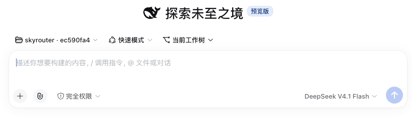
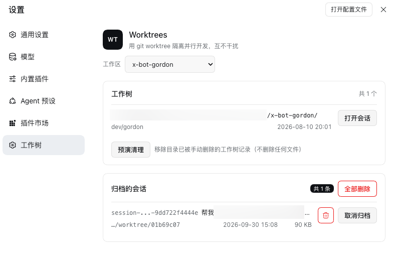
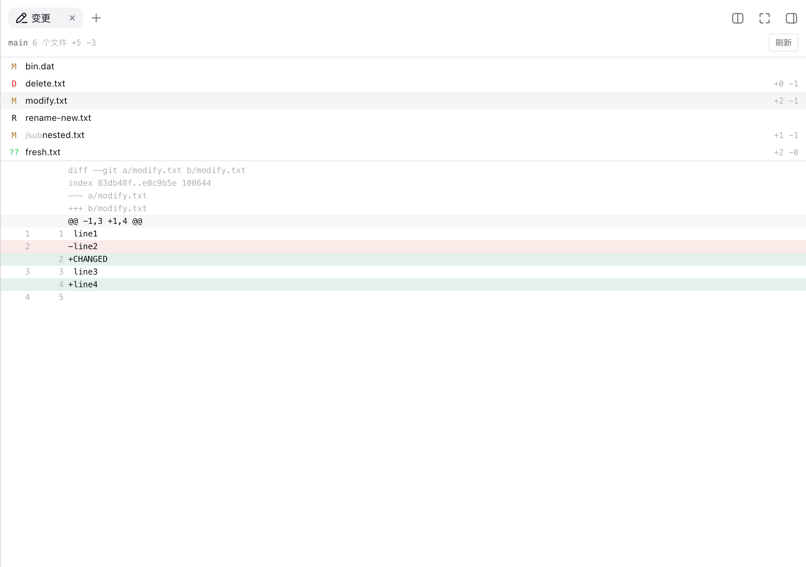

# gord-dsh-worktree

Git worktree management for [DeepSeek Harness](https://github.com/deepseek-ai/deepseek-harness) — isolate
parallel work in its own directory and branch. It also ships **Fast mode (快速模式)** as an agent preset
and an opt-in patch that lets read-only tool calls run concurrently.

[中文说明](README.zh.md)

## Features

1. **Create worktrees** — an isolated checkout and branch in one atomic command, from the agent
   (`worktree_list`, `worktree_create`, `worktree_status`, `worktree_remove`, `worktree_prune`) or from
   *Settings → Worktrees*.
2. **Start a session in a worktree** — the New Session row carries a working-location picker: stay in the
   current worktree, or create a fresh one and open the session inside it.
3. **Review changes** — the right sidebar's *Changes* tab shows the uncommitted diff of the session's own
   directory: every changed file with its counts, and the selected file's patch.
4. **Manage archived sessions** — *Settings → Worktrees* lists every session archived on this machine, with
   **Unarchive** per row, a delete icon, and **Delete all** for the set.
5. **Double-click to rename** — rename a session from its sidebar row, without the menu.
6. **Fast mode (快速模式)** — a slim agent preset that ships in the bundle patch, so the preset picker
   has it as soon as the plugin is installed. See [Fast mode](#fast-mode-快速模式) below.
7. **Concurrent read-only tool calls** — an opt-in patch for `bash`, `glob` and `grep`, so a step that
   batches reads overlaps them instead of running them one after another. See
   [Concurrent read-only tool calls](#concurrent-read-only-tool-calls) below.






## Install

```sh
dsh plugin --profile web add github:nightosong/gord-dsh-worktree
```

Then restart `dsh web` (a reload is enough once the bundle is on the layer stack) and open
**Settings → Worktrees**. Nothing else needs editing: the package declares `dsh.bundle.patch`, so the
CLI adds it to the profile's bundle stack itself.

Fast mode arrives with it — the same patch declares the `fast` agent preset, so the preset picker has
**快速模式** without a profile file being edited. If the profile's own `cordis.patch.yml` already declares
a `preset-fast` row (the hand-written way), delete that row: the bundle layer merges first, and two rows
with the same id mount the preset twice, which the loader does not refuse. Which preset new sessions
*start* in stays a user choice (`agent-preset-registry` in the profile patch); the bundle never sets it.
The flip side of that split: this bundle is what declares Fast mode, so if you uninstall the plugin,
change or remove that `default: fast` row as well — otherwise it names a preset that no longer exists.

The concurrency patch is the one opt-in step, because it edits core tool packages rather than the
composition:

```sh
cd /path/to/gord-dsh-worktree
npm run patch:concurrency     # --check to inspect first, --revert to undo
```

It needs a `dsh web` restart, and it is idempotent — run it again after any DSH upgrade, which restores
the files it edits.

Supports dsh `>=0.1.5-rc.1 <0.2.0` — the whole 0.1.x line from `0.1.5-rc.1` on. Three of them are
tested: `0.1.5-rc.1`, `0.1.6-alpha.2` and `0.1.7-rc.2`. Glyph export names, session navigation and the
plugin settings interface all changed across that span, and the plugin handles each shape — see
*Across DSH versions* below.

Two features added in 0.3.0 need more than that floor does, so the minimum is per feature rather than per
package:

| Feature | Minimum dsh | Why |
| ------- | ----------- | --- |
| Worktree tools, *Settings → Worktrees*, the sidebar *Changes* tab, archived sessions | `0.1.5-rc.1` | The plugin's own code, with a fallback for every interface that changed across 0.1.5–0.1.7 |
| Sidebar nested grouping and double-click rename | `0.1.5-rc.1` | Patched into the browser bundle: nested grouping is two sites (the session list and the workspace tree), double-click rename is native from 0.1.7, where the script reports `native` |
| **Fast mode (快速模式)** | `0.1.7` | A preset is an `@deepseek-ai/dsh-agent-preset` composition row — 0.1.5/0.1.6 discovered presets from `$DSH_HOME/.agent-presets` instead, and 0.1.7 replaced that. On a build without the package the `preset-fast` insert has nothing to mount: delete that insert from `cordis.patch.yml`, or stay on 0.1.7+ |
| **Concurrent read-only `bash`/`glob`/`grep`** | `0.1.7` | The patch matches the 0.1.7 core files exactly. On any other build `npm run check:concurrency` reports `unknown` and the tool refuses to write rather than guess |

## Across DSH versions

Three interfaces a plugin can see changed between 0.1.5 and 0.1.7. The plugin keeps the old call as a
fallback and uses the new one where it exists, so one build runs on either line:

| Interface | 0.1.5 / 0.1.6 | 0.1.7 on | What the plugin does |
| --------- | ------------- | -------- | -------------------- |
| Glyph export names | `IconTrashOutline16` and friends, size-suffixed | `IconTrashOutlineRegular` and friends, weight-suffixed | Tries both names, draws nothing if neither exists, and never hands React an `undefined` element type |
| Session navigation | `sessions.open(id)` | `uiWorkspace.openSession(id)`; `sessions.open` is gone | Reveals through the workspace view, falls back to the old call when there is none |
| Plugin settings namespace | `settings.register(ns, schema)` | no such method; the profile's own form model replaces it | Registers a namespace only where that method exists, and reads the entry's config directly otherwise |

Both `uiWorkspace` and `settings` are read optionally (`ctx.get`), so a profile composed without a
workspace view, or without settings, loses one feature rather than failing to apply.

A DSH upgrade also restores the two core tool packages the concurrency patch edits (`dsh-tool-bash` and
`dsh-tool-fs-search`) — the preset that ships with the plugin is untouched by an upgrade, since it lives
in this package. Re-run `npm run patch:concurrency` after one, and use `npm run check:concurrency` to see
where it stands: `patched`, `original`, or `unknown` when the build moved on, which the tool refuses to
force and reports instead.

## In detail

### Picking up someone else's branch

`worktree_create` with `branch: colleague/feature` and **no** `base` starts from
`origin/colleague/feature` and tracks it. This is the case that used to be quietly wrong: the branch
did not exist locally, so git created a fresh empty branch of the same name off the current one and
the caller believed they held the colleague's commits.

An explicit `base` is still honoured — a deliberate *new branch from main* has to stay possible — but
the result then carries `shadowedRemote` so the ambiguity is visible.

### Working location for a New Session

The menu offers exactly two entries: **Current worktree**, where a session starts unless you ask
otherwise, and **New worktree**. Existing worktrees are deliberately not listed — they are second
checkouts of a project the session already belongs to, so a worktree is reached by its path rather than
by a second sidebar entry.

**New worktree takes no input and asks no questions.** The branch is cut from the current one and named
for the code that names the directory, so the whole decision is "a fresh checkout" versus "here". Pick
it and you are in the new worktree: the worktree is made, registered, and a session is started and
opened inside it, ready for your first message. Once there, the branch is yours — create or switch
branches with ordinary git when the task calls for it; changing branch does not need a new worktree.

**Which project, and where the checkout goes.** A worktree belongs to a project, and the project is
resolved rather than chosen: it is the workspace the new session is being started in — read from the
picker in the same row, or from the session itself — and that workspace's repository, or the repository
inside it when the workspace is a container of projects (`apifree` holds `backend/rest-atlas` and
`backend/oms-atlas`; `x-gordon` holds four more). Only when none of that is readable does it fall back
to the most recently used repository workspace. The control names the project it will use, so nothing is decided invisibly, and the new
worktree is cut from that project's current branch. The checkout itself always lands in
`$DSH_HOME/worktree/`, outside every project: a worktree inside its own repository shows up in that
project's `git status` and diffs, which is what that location exists to avoid. A requested path inside
the project is refused rather than quietly relocated.

**It has to happen on the click, not on the first message.** A session's directory is fixed when the
session is created, and the blank session in the composer is created before anything is typed, so there
is no later moment at which a message could be aimed at a directory that does not exist yet. Creating
the worktree and the session together is the only order that works; a version that created the worktree
and left the session alone reported success and quietly ran the conversation in the project anyway.

**The patches are ensured at load, because the install step cannot ensure them.** `dsh plugin add`
hands its arguments to pnpm, and pnpm runs no lifecycle script for a `link:` package — which is how this
plugin is normally installed — so there is nowhere to hook. The host half therefore runs both tools on
every start: an unchecked patch is the one thing an upgrade breaks silently, since the plugin keeps
loading while the behaviour goes missing. A missing patch is installed and logged with the restart it
needs, a build whose anchors have moved is warned about instead of forced, and everything already in
place is a no-op. `node tools/patch-sidebar.mjs --check` (or `npm run check:concurrency`) remains for
confirming by hand, and `--revert` for undoing.

dsh 0.1.7 is what makes this necessary: it widened the session-list grouping function by one parameter,
so the anchor for the old shape stopped matching — while `--check` still called it patched, because the
session-list marker is a prefix of the workspace-tree marker and it matched the substring. The two sites
are separate behaviours now and markers match a line of their own, so a build patched at only one of them
is reported as the other being missing.

**A worktree is filed under the project it came from.** The sidebar groups them by a map the plugin
publishes from the project root, so a worktree is not a project of its own: it sits under the project it
was cut from, the way the original release showed it. A `create` response names the new directory but
not its project, so the root has to be published from what was resolved — otherwise the worktree appears
at the top level until something else happens to list the project.

**A worktree is registered as a workspace, and that is not a choice.** Workspace membership is exact
path equality (`sessionPath(id) === record.path`), `attachSession` rejects a session whose cwd differs
from its workspace path, and the record itself carries no hidden or archived flag. A session rooted in a
worktree therefore needs a workspace at that path — without one the shell has nowhere to draw it and
shows *choose a workspace to start* over a session that does exist. So each worktree you start a session
in appears in the sidebar beside the project, titled by its directory code, exactly as the core's own
*new workspace* flow would leave it. Registering on its own is also available as the explicit
**Open as workspace** action in Settings.

Only this route adopts. `worktree_create` does not: a worktree made mid-conversation leaves the session
where it is, so it needs no workspace, and adopting there would add a sidebar entry nobody asked for.

#### The sidebar patch: nesting a worktree under its project

The sidebar should show a worktree's sessions under the project they were cut from, rather than as a
project of their own, and before 0.1.7 it also lacked a double-click rename. Both are patched into DSH's
workspace bundle by this repository:

```sh
npm run patch:sidebar                 # then restart dsh web
npm run patch:sidebar -- --check      # one status line per behaviour; exits 0 only when all are in place
npm run unpatch:sidebar               # to restore the shipped bundle
```

The three version lines have different shapes, and the script decides from the bundle's actual contents
rather than from a version number — patching only the part that build is missing:

| DSH | Nesting | Double-click rename |
| --- | ------- | ------------------- |
| 0.1.7 on | both grouping sites: `groupByWorkspace` (the session list — 0.1.7 gave it an `archivedFilter` parameter, so the anchor for the old signature stopped matching) and `owningParentFolder` (the workspace tree); each reads the parent map this plugin publishes besides path containment | core ships it; the script reports `native` and does not touch it |
| 0.1.6 | the same function (that line already has the *Workspace tree* view and this helper) | adds `onDoubleClick` to the session row |
| 0.1.5 | `groupByWorkspace` — the whole of the sidebar's grouping — folds a worktree's sessions into the project's group | the same row prop |

**The nesting shows in either grouping.** The default *Workspace* list is `groupByWorkspace` and the
*Workspace tree* view is `owningParentFolder`; both sites are patched, so a worktree folds under its
project whichever one the sidebar is set to. The script never writes the user's view options.

Two rules decide the parent: a workspace whose directory is inside another's, and a parent map this
plugin publishes for worktrees kept outside the project — which is the default,
`$DSH_HOME/worktree/<code>`. From 0.1.6 that second rule lives in `owningParentFolder`, the single
source of the tree's parent map and its only call site; on 0.1.5 it lives in `groupByWorkspace`. The map
is read from `localStorage`, because the first render after a reload already needs the answer and a fetch
would land too late. Entries naming a path that is gone, the child itself, a directory inside it, or a
parent that is not a registered workspace are all ignored.

**Double-click to rename** adds one prop to the session row, calling the handler the row's own menu
already calls — so the dialog, its validation and its error text are core's, not a second copy of them.
Blank sessions are skipped, matching that menu, which hides its actions for them: a blank session has no
title to edit yet (the dialog would open empty) and the first message names it afterwards, so the edit
would be overwritten rather than kept.

Why patches and not the plugin: a client plugin can only nest by taking over the whole
`sidebar.workspaces` slot, which is `single` and owns the section header, the search box, every session
row and every workspace dialog — 14 components, with drag reordering, rename, archive and fork. Taking it
over would mean reimplementing all of it and drifting from core on every release. The grouping function
is a dozen lines, and the rename hook is one prop.

**A DSH upgrade replaces the file, so re-run `npm run patch:sidebar` after one.** The script is
idempotent, keeps the shipped bundle at `client.js.orig` before the first patch, and refuses to guess if
the code is not in the shape it expects — a newer DSH needs the patch updated rather than forced. Each
behaviour carries its own marker, so an install that already has one still receives the other, and a
replacement is only written once every anchor it needs has been found. `--check` prints `patched`,
`original` or `native` per behaviour, and reports `not in the expected shape` with a non-zero exit for a
behaviour it does not recognize — which is what a DSH upgrade that moved these functions again looks
like.

#### Keeping the sidebar clean

The worktree's workspace is titled after its project — `repo · 1dda6ec0`, not a bare `1dda6ec0` — because
the title is the one place the relationship is visible without the patch. With it applied, both the
default *Workspace* list and the *Workspace tree* view fold the worktree under its project. Codex reads
cleanly here for a structural reason rather than a
smarter trick: it groups threads by *project* and treats the worktree as an attribute of a thread, so a
worktree thread simply lands under its project. DSH's grouping key is the directory, which is why the
patch has to add the parent relation.

If you would rather not see the groups at all, the shell already has the mode for it: **View options →
Group by → In one list** in the sidebar header. Sessions from every workspace become one recency-ordered
list, so a worktree session sits beside the project's with no heading of its own. It is a saved preference,
it applies immediately, and no plugin change is involved — it is the closest thing to Codex's sidebar that
the current shell offers.

The menu dismisses on a pointer anywhere outside the control and on Escape (which also returns focus to
the trigger). The core selectors get that from the shared `Menu` primitive; this one cannot use it,
because this panel is not a flat `{id, label}` list — it carries a status line and a busy state — so the
behaviour is reproduced directly.

It sits on the Hero's own working-location row, beside the workspace and preset controls, and is styled
to match them exactly: the same borderless 16px-radius pill, the same 13px/500 type, the same shared
chevron and icon package. The icons come from `@deepseek-ai/dsh-client-ui-primitives`, which is
declared in `dsh.client.inject` — a client plugin can only `require` a package the boot graph wires in.
That row is
laid out by the core plugin and all three `conversation.hero.*` slots are `single`, where a second
occupant *shadows* the first instead of sitting beside it — so the control is rendered onto the row's
element with `createPortal`, which is how the core plugins place themselves inside surfaces they do
not own. The row is found from this plugin's own host outward via the `conversation.hero.workspace`
`data-slot` anchor, not by a document-wide query. If no row can be found the control renders in place
rather than disappearing.

### Reviewing changes in the sidebar

The right sidebar's *Changes* tab shows the uncommitted diff of the session's own directory: every
file that differs from `HEAD`, its status and line counts, and the selected file's patch with both
line-number columns. It is the working tree against `HEAD` — staged and unstaged together — rather
than the session's own edits, because what a person reviews before committing is what is on disk,
whichever tool put it there: an agent's file edit, a formatter, or their own editor in the next
window. The session's own edits are already diffed inline in the conversation, from the tools' own
reports.

A worktree is an ordinary repository to it. The tab asks the host about the directory the session
runs in, so a session that moves into a worktree follows along without the tab being told it did.



It is registered through the same `sidebarRightTabs` registry the built-in file tree and document
preview use, and both of its slots — the body and the tab title — are injected from a child scope, so
a profile composed without the right sidebar loses the tab instead of failing to apply the plugin.
Open it from the right sidebar's start page, where it is listed beside *Workspace files*.

### Fast mode (快速模式)

An `@deepseek-ai/dsh-agent-preset` row is part of the composition, and a bundle's patch file is a
composition layer, so this plugin *declares a preset*: `preset-fast`, id `fast`, `order: 0`. Install the
plugin and the picker has it; there is no second copy to keep in sync.

Fast mode keeps the default agent's standards — understand before you act, act on evidence, prove the
change, report what is true — and drops the process around them. It is the `standard` preset minus the
heavy orchestration surfaces (no plan mode, no goals, no subagents, no workflows), so it has 14 plugin
rows instead of 31 tools: shell, files, search, web, skills, todos, background jobs, user questions, and
context compaction.

What its persona adds is measured, not stylistic. Session logs on real work showed 30–150 model round
trips per turn at 6–12 s each, `bash` making up 81–94% of all tool calls, and roughly a third of the
steps that call tools already batch two of them. So the preset's rules are: recon the facts that decide
the answer and then answer or execute in the *same* turn; send independent actions in one round; never
open a question mid-run (ask once, as the opening move); never wait inside the turn — a build, a sweep or
a long query goes to a background job; keep the context small, because it is re-sent on every step; and
skip the survey that cannot change the conclusion.

It deliberately picks no model. A preset row is composition, not configuration: this one carries no
`llm-*` and no `agent-default-model` row, and no `model` field — Fast mode runs on whatever model the
profile configures, so the same preset works for every user. The only reference to a model is the
persona's `{{model}}` placeholder, which merely names the configured model so the agent knows what it is.

### Concurrent read-only tool calls

`dsh-agent-loop` runs a step's tool calls in parallel only when each call is classified concurrency-safe,
and `dsh-tools` treats a tool with no `isConcurrencySafe` as exclusive. In the installed core that is
`bash`, `glob` and `grep` — which is why a step that batches two `bash` calls still runs them one after
another, and why a batched `read` waits behind a `bash` beside it.

`npm run patch:concurrency` adds the missing classification in three places:

| Target | What it adds |
| ------ | ------------ |
| `dsh-tool-bash` | `isConcurrencySafe: (args) => isReadOnlyCommand(args?.command)`, using `lib/read-only-command.js` — shipped by this plugin and copied into the package |
| `dsh-tool-fs-search` | `isConcurrencySafe: () => true` for `glob` |
| `dsh-tool-fs-search` | `isConcurrencySafe: () => true` for `grep` |

The classifier is fail-closed. A command is parallel only when *every* `|`, `&&` and `;` segment starts
with a command from a small read-only allowlist — `ls`, `cat`, `head`, `grep`, `rg`, `find` (without
`-delete`/`-exec`), `sed` (without `-i`), `awk`, `jq`, `yq` (without `-i`), `sort` (without `-o`),
`diff`, `stat`, `ps`, `pgrep`, `lsof`, `dig`, `curl` (without `-X`/`-d`/`-o`/…), the read-only
subcommands of `git`/`docker`/`npm`/`kubectl`/`gh`, and so on — with no `>` anywhere and no command
substitution. Everything else is exclusive, exactly as before: writers, `sed -i`, `npm install`, `git
commit`, scripts (`node x.mjs`, `python3 scripts/…`), loops, `sleep`, `xargs`, and anything unrecognized.

Three properties matter as much as the classification:

- **Idempotent and recognizable.** Each row carries a marker; `--check` reports `patched`, `original`,
  or `unknown` per row and exits 2 while anything is still pending.
- **Fail-closed on a changed build.** Every anchor must match exactly once before any file is written, so
  a DSH build that moved on leaves all of them untouched and exits 1 with `not in the expected shape`
  rather than half-patching.
- **Reversible.** `npm run unpatch:concurrency` restores each file from the `.orig` backup the patch
  wrote beside it and removes the classifier it installed.

### The archive

DSH archives a session by adding its id to one array on the workspace registry, and it offers no way
back: the remote contract has one archive method and nothing else, no CLI command touches it, and no
screen lists what was archived — the whole client carries exactly one archive string, the menu item
that does the archiving. A session that is archived leaves every grouping surface with no record to
review and no control to undo it.

**Settings → Worktrees** now ends with an *Archived sessions* card listing every session archived on
this machine, newest archive first: its title, the project it ran in, when it was created, when it was
archived, and how much its log takes on disk. Each row carries **Unarchive** and a delete icon, and the card's
top right carries **Delete all**.

Unarchiving writes through the registry's own serialized operation queue and its `setState` — the pair
`archiveSession` itself uses — so the change is durable *and* lands on screen at once: the sidebar gets
the session back in its original position, with no restart. Archiving only ever hid it; nothing was
moved or deleted.

**Delete all** is the one irreversible control in the plugin. It removes each listed session's log
directory, its cached projections and its workspace membership, behind a confirmation that names the
count. **Each row has the same delete as an icon**, for the far more common case of one session
archived by mistake rather than ninety. Both send back the exact ids they listed rather than a "delete
everything" flag, so a session archived between the listing and the click is never swept up. A session
that is still live is skipped and reported, instead of having its log pulled out from under a running
agent.

The archive entry is the one thing deletion keeps. Core's only switch for "do not show this Session"
is the archive set — `sessionVisible` consults it on every render — and core cannot express "this
session is gone" at all. An id whose log is removed but which is left unarchived falls out of its
workspace and into the browser's *Ungrouped* bucket, as an empty group that survives until the page is
reloaded. Keeping the entry is what makes the session stay hidden, immediately and after every reload;
the panel drops these ids from its own listing because there is nothing left to show.

They do not stay forever: on every load the plugin forgets the archived ids whose log is already
gone. That is the one safe moment for it — the host has just scanned its sessions off disk, and every
client that connects afterwards builds its list from the same scan, so those ids cannot come back as
rows. While the app runs the entry is still doing its job, because the browser is holding that
deleted row. Left alone they only accumulate, and the archived filter DSH 0.1.7 added to the sidebar
("show archived", "only archived") renders the leftovers as an *Ungrouped* group whose rows have no
log left to delete.

Each row carries one date, and it is the session's last write — read off the newest mtime in its log
directory during the same scan that measures its size. That is the honest answer to "when was this last
used", which is the question a list of archived sessions is actually asked. A projection could answer
`lastPromptAt` instead, the field the sidebar itself sorts by, but it only exists for a session the
projection cache holds a row for, and cold-reading the rest costs a whole log per row — so a session
that never wrote after it was created falls back to its own creation date, and that is the only case in
which a row shows one.

Archive *times* are not DSH's to give either: the archive set is a bare id array with no timestamps
anywhere. The plugin records them itself, in `$DSH_HOME/gord-dsh-worktree/archived-at.json`, from the
moment it loads, and uses them to keep the list newest-archived-first. They are deliberately **not
shown** on a row: they are the plugin's own bookkeeping rather than a fact about the session, and a row
is easier to read with one date than three.

### Renamed from `dsh-worktree`

The package id, module id, HTTP routes, and settings namespace are all
`gord-dsh-worktree` now. If you installed under the old name:

```sh
dsh plugin --profile web remove dsh-worktree
dsh plugin --profile web add github:nightosong/gord-dsh-worktree
```

## Tools

| Tool | What it does |
| ---- | ------------ |
| `worktree_list` | Every worktree of a repository: path, branch, HEAD, and current/detached/locked/pruned state — plus every local and remote-tracking branch, which is what to consult before naming a base. |
| `worktree_create` | Creates the directory and its branch in one command; checks out an existing branch instead of recreating it, and starts from a remote-tracking branch of the same name when only that exists. |
| `worktree_status` | One worktree's branch, upstream line, and changed files. |
| `worktree_remove` | Removes a worktree. Refuses when it holds uncommitted or untracked changes; `force` discards them on purpose. |
| `worktree_prune` | Drops records of worktrees whose directories are gone. Deletes no files. |

All five resolve the repository from the session directory by default and accept `workdir` (or `repo`) to
point at another one.

## Safety rules

- The main worktree is never removable.
- A dirty worktree is never removed without `force` — and "dirty" counts untracked files, because
  `worktree remove --force` would delete them.
- A locked worktree is reported, not silently unlocked.
- Branch names are validated by `git check-ref-format`, and every worktree path is passed to git as a
  positional argument, never through a shell, so a name can never become a flag.
- The HTTP surface the panel uses runs git on this machine, so the mutating route accepts same-origin
  and loopback callers only. It is not a remote API.
- Deleting archived sessions is the only destructive operation that is not about git, and the only one
  that cannot be undone. It is behind an explicit confirmation, it removes only the ids it was handed,
  and it refuses to touch a session that is still running.
- The concurrency patch decides only *scheduling*, never what runs: a call classified parallel is still
  the same command with the same result. Its classifier is fail-closed, so the worst case is the old
  behaviour — a read-only command that stays exclusive — and a command it does not recognize is never
  made parallel.

## Settings

| Field | Default | Meaning |
| ----- | ------- | ------- |
| `defaultParent` | *(empty)* | Directory new worktrees are created in. Empty uses `$DSH_HOME/worktree/`. Set it in this profile entry; the panel displays it but does not edit it. |

The *Settings → Worktrees* page manages exactly one project, and resolves which one for you: the
repository the active session is working in, or — when that is not a repository — the most recently
used of your workspace repositories. It names the project it resolved, and there is nothing to type or
pick: no path field, no repository diagnostics. Worktrees are created outside every project, so a
checkout never appears in its own project's diffs.

## Development

The plugin is plain ESM with no build step: `lib/index.js` is the host half, `lib/client.js` is the
browser bundle loaded through `window.__ModuleLoader__`, and `lib/service.js` + `lib/worktree.js` hold the
git logic both halves share.

```sh
# install a checkout into a profile as a live dependency
dsh plugin --profile web add /absolute/path/to/gord-dsh-worktree
```

A checkout installed by path resolves Node imports from its own directory, while DSH's packages resolve
from the profile — so the host half cannot see `@deepseek-ai/dsh-tools` unless the checkout can reach
them. Link the peers once in a local checkout (they are gitignored):

```sh
mkdir -p node_modules/@deepseek-ai
SRC=$(dirname "$(readlink -f "$(which dsh)")")/../node_modules/@deepseek-ai
for p in schemastery dsh-tools dsh-settings cordis; do
  ln -sfn "$SRC/$p" "node_modules/@deepseek-ai/$p"
done
```

An install from GitHub or npm inside a profile needs none of this: there the peers resolve through the
profile's own `node_modules`, exactly as for every other plugin.

Because the host half is mounted as a bundle layer, host-side changes need a `dsh web` restart; client
changes reload with the GUI's normal module reload. The bundle patch is re-read on every session
activation (`patchReload: live`), so a preset change there needs a new session rather than a restart.

`npm test` runs five smoke suites — the host one against a throwaway git repository, the client one
against a minimal React runtime (covering all three glyph naming schemes and both navigation paths), the
sidebar patch tool against a copy of the **installed** DSH bundle, the concurrency patch tool against
synthetic packages plus a read-only check of the installed core (proving pending → patched → idempotent →
reverted, that an unrecognizable build writes nothing, and that the classifier keeps writers exclusive),
and the bundle patch's own shape (one mount row, one `preset-fast` with exactly the fourteen plugins, no
personal data) — with no test framework to install.

The three tools, none of which is needed to *use* the plugin:

| Script | What it does |
| ------ | ------------ |
| `npm test` | The five suites above. |
| `npm run patch:sidebar` / `unpatch:sidebar` | The sidebar's nested worktree grouping and double-click rename, patched into the installed browser bundle. |
| `npm run patch:concurrency` / `unpatch:concurrency` / `check:concurrency` | Concurrent read-only `bash`/`glob`/`grep` calls, patched into the installed tool packages. |

## License

MIT